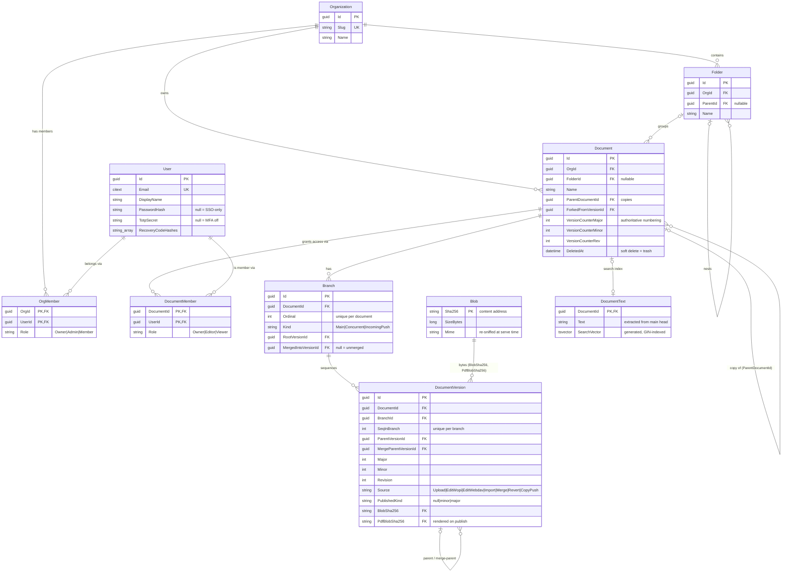
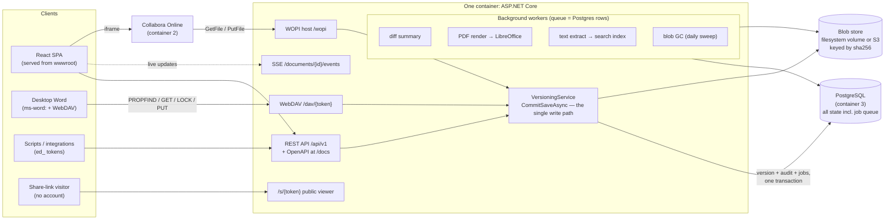
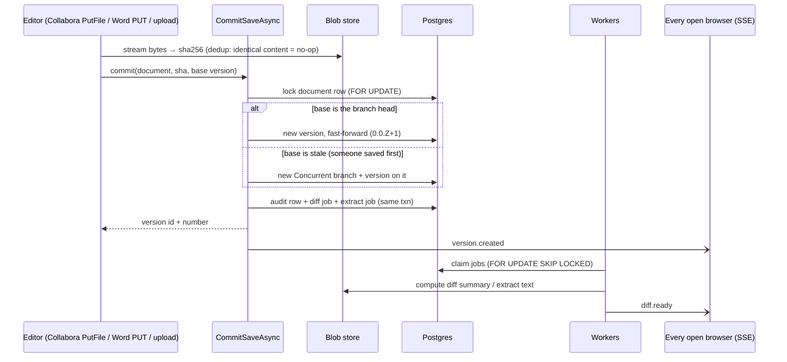
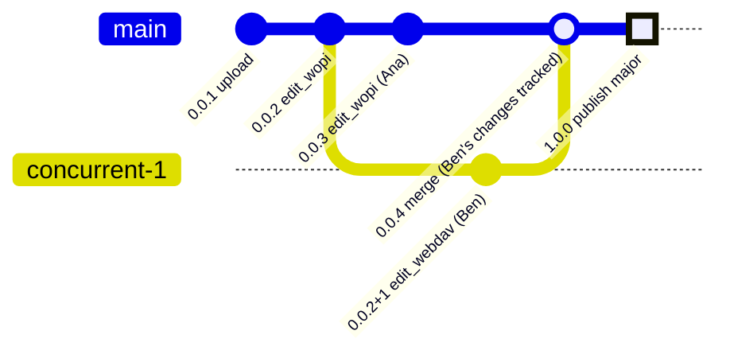

# easydocs — Domain Model & Schema

The companion to [architecture-decisions.md](architecture-decisions.md): the ADRs say *why*, this
says *what*. Every diagram below is generated-from-nothing — it mirrors `src/EasyDocs.Api/Domain/`
and the EF Core model in `Data/EasyDocsDbContext.cs`, which are the source of truth.

**How classes become schema.** There is no separate schema definition: each C# class in `Domain/`
is an EF Core entity and maps 1:1 to a Postgres table (`DocumentVersion` → `Versions`, the rest by
pluralized name). Conventions applied across the model:

- **Enums are stored as strings** (`VersionSource`, `BranchKind`, `OrgRole`, `DocRole`) — readable
  in psql, no magic numbers.
- **Every FK is `ON DELETE RESTRICT`.** Soft-delete (`DeletedAt`) plus immutable versions mean a
  cascade must never fire; the schema refuses deletes that would dangle history.
- **No navigation properties.** Entities are flat records; queries join explicitly. Keeps the model
  legible and the SQL predictable.
- **Secrets never at rest.** `ShareLink`, `Invitation`, `ApiToken` store SHA-256 `TokenHash`es;
  recovery codes on `User` are hashes; the raw value is returned exactly once at creation.
- **Guid PKs default to `gen_random_uuid()`** DB-side; `Email` is `citext` (unique,
  case-insensitive); `DocumentText.SearchVector` is a **stored generated `tsvector`** with a GIN
  index — Postgres computes it, the app never writes it.
- **Migrations run at container boot** (`Database.Migrate()`), so a self-hoster's upgrade is
  "pull the new image".

## The core: organizations, documents, versions

Identity on the left, the versioning engine on the right. `Branch` + `DocumentVersion` form the
DAG: every version belongs to a branch, points at its parent, and (for merges) at a second
merge-parent. `Blob` is content-addressed — `Sha256` **is** the primary key — so versions across
all documents and orgs share identical bytes.

## The collaboration surface

Everything that *points at* the core: edit sessions (browser and Word saves), approvals, share
links, invitations, push-back between copies, API tokens, the audit trail, and the job queue.

```mermaid
erDiagram
    DocumentVersion ||--o{ EditSession : "base of"
    DocumentVersion ||--o{ ApprovalRequest : "decided on"
    DocumentVersion ||--o{ ShareLink : "shared as"
    Document ||--o{ PushRequest : "copy pushes back"
    Organization ||--o{ Invitation : invites
    Organization ||--o{ ApiToken : scopes
    Organization ||--o{ AuditEvent : records

    EditSession {
        guid Id PK "WOPI file_id / DAV session"
        guid DocumentId FK
        guid BaseVersionId FK "branch-on-stale anchor"
        guid UserId FK
        string LockValue "shared by WOPI + WebDAV"
        string LastCommittedSha "what the editor saved last"
        datetime ClosedAt
    }
    ApprovalRequest {
        guid Id PK
        guid VersionId FK
        guid ApproverId FK
        string Decision "null|approved|rejected — immutable once set"
        datetime DueAt
        datetime CancelledAt
    }
    ShareLink {
        guid Id PK
        guid VersionId FK "version-scoped, not document"
        string TokenHash UK "raw token shown once"
        datetime ExpiresAt
        datetime RevokedAt
        int ViewCount "every anonymous view audited"
    }
    PushRequest {
        guid Id PK
        guid CopyDocumentId FK
        guid TargetDocumentId FK
        guid SourceVersionId FK
        string Status "pending|accepted|rejected"
        guid MaterializedVersionId FK "the incoming branch, on accept"
    }
    Invitation {
        guid Id PK
        guid OrgId FK
        citext Email
        string Role "org role on accept"
        guid DocumentId FK "optional doc grant"
        string TokenHash UK
    }
    ApiToken {
        guid Id PK
        guid OrgId FK
        guid UserId FK "capability is capped by this user's role"
        string TokenHash UK "ed_ prefix, hashed at rest"
    }
    AuditEvent {
        guid Id PK
        guid OrgId "FK-light: append-only"
        guid DocumentId "nullable"
        guid ActorUserId "nullable — anonymous share views"
        string Action "version.created, share_link.viewed, ..."
        jsonb Metadata
    }
    BackgroundJob {
        long Id PK "claim order"
        string Type "diff|pdf|extract"
        string Payload "JSON"
        int Attempts "dropped loudly at 5"
        datetime RunAfter "lease + retry backoff"
    }
```

## Components: who talks to whom

## The write path: what one save actually does

Any editor, same sequence. The job rows commit **in the same transaction** as the version — a job
exists iff the work it serves committed (ADR-4).

## What a history looks like

The `Branch`/`DocumentVersion` rows draw this DAG — it's what the History tab's Graph toggle
renders. Concurrent branch: two saves from `0.0.2`; the merge lands the branch's work on main as
tracked changes and stamps `MergedIntoVersionId`.

## Where to read the real thing

| Layer | Where |
|---|---|
| Entities ("classes") | `src/EasyDocs.Api/Domain/*.cs` — one file per table, no navigations |
| Mapping & constraints | `src/EasyDocs.Api/Data/EasyDocsDbContext.cs` |
| Actual DDL | `src/EasyDocs.Api/Data/Migrations/` (generated, never hand-edited) |
| The single write path | `src/EasyDocs.Api/Versioning/VersioningService.cs` |
| Endpoint groups | `src/EasyDocs.Api/{Auth,Documents,Editing,Publishing,Approvals,Copies,Sharing,Diffing}/` |
| Why it's shaped this way | [architecture-decisions.md](architecture-decisions.md) and `docs/superpowers/specs/` |
