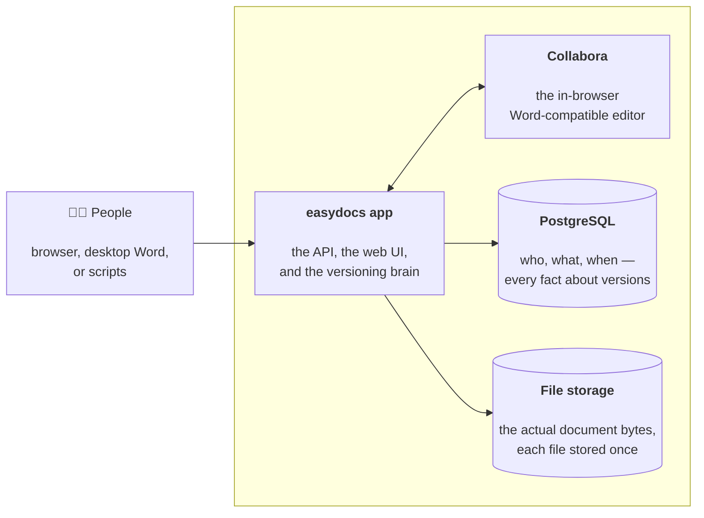
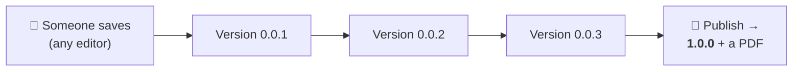
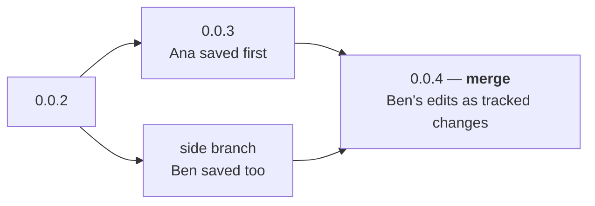

# How easydocs works — the 5-minute version

*The plain-words companion to [architecture-decisions.md](architecture-decisions.md) (the why) and
[design-schema.md](design-schema.md) (the full schema). Start here.*

**One sentence:** easydocs is version control for Word documents — every save is kept forever,
nothing is ever overwritten, and nobody has to learn Git.

## The pieces

Three containers. One holds the app, one holds the data, one holds the editor. That's the whole
system.

## The one big idea: saves become versions, automatically

You never "save as v2". You just save — from the browser editor, from desktop Word, or by
uploading a file — and easydocs turns it into the next numbered version. Old versions are never
changed and never deleted.

## What if two people edit at the same time?

Nobody's work gets overwritten and nobody gets blocked. The second person's save simply becomes a
**side branch**, visible in the history. One click **merges** it back, with their edits shown as
tracked changes — like Word's "Track Changes", but nobody had to remember to turn it on.

## The five things worth remembering

1. **Every save is a version, forever.** The history is the truth — "which file is the latest?"
   stops being a question.
2. **Compare any two versions and get a real redline** — insertions and deletions computed from
   the documents themselves, Track Changes on or off.
3. **Publish when it's ready.** Drafts are `0.0.x`; publishing stamps a real number (`1.0.0`),
   renders a PDF, and can ask named people for a one-time approve/reject.
4. **Share without accounts.** A share link shows one specific version on a plain download page —
   expiring, revocable, and every view is logged.
5. **The API can do everything the UI can.** Anything you click, a script can call.

## Who sees what

Access is granted **per document**: each person on a document is a **Viewer** (read, compare,
share), an **Editor** (that plus edit and publish), or an **Owner** (that plus approvals and
membership). Being in the organization alone grants nothing — documents are invited-into, one by
one, and everything anyone does lands in the document's audit trail.

---

*Want more depth? [The user guide](https://robertzu43.github.io/easydocs/user-guide/) shows every
screen; [design-schema.md](design-schema.md) has the full data model; the ADRs explain every
design choice.*
